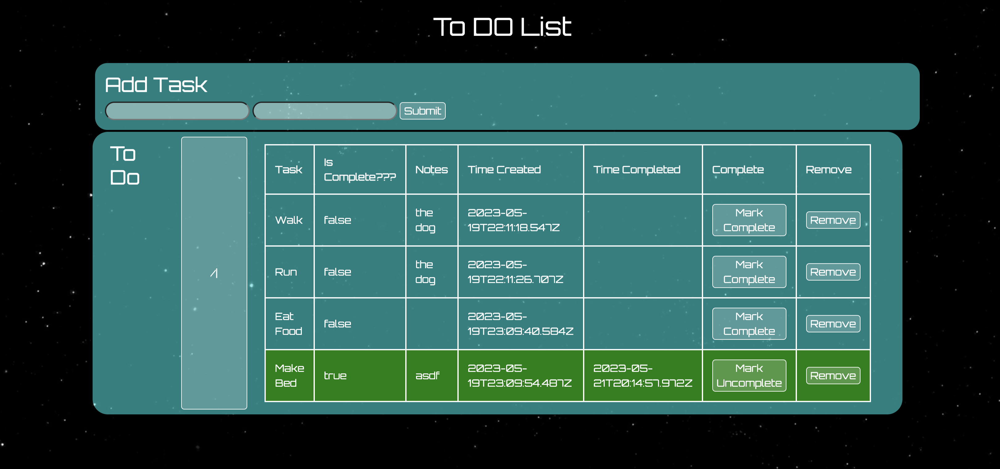

# Weekend Challenge: SQL To-Do List
    

## Description

Duration: Weekend Project

Problem: Create a a To Do list that uses the full stack.

## Built With

    Node JS
    Express
    Body Parser
    Jquery
    Bootstrap
    Sweetalert
    PG
    PostgreSQL

## Installation

1. Clone repository 
2. Run `npm install`
3. Create a database with the name `todo_list`
4. Copy in the `CREATE TABLE` query that is in the `database.sql` file.
5. The database is set up to run on port `5432` by default change this in the `listPool.js`
6. Run `npm start`

## Screenshot

